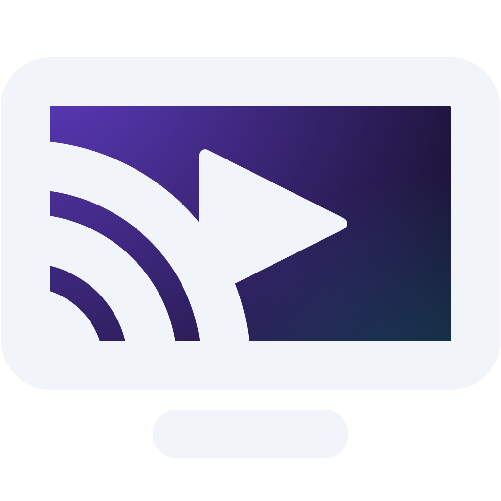

<div align="center">



# media-cast

**Stream local video files to your TV — drop a file in and press play.**

No TV-side setup. No media library to configure. No account. Works with **Chromecast** and **UPnP/DLNA** devices on your local network.

[](https://github.com/michelsalib/media-cast/releases/latest)
[](https://github.com/michelsalib/media-cast/releases)

[](https://www.electronjs.org/)

</div>

---

## Features

| | |
|---|---|
| **Zero TV setup** | Discovers Chromecast and DLNA renderers automatically on your LAN |
| **Subtitles, your way** | External (`.srt`, `.smi`, …) and embedded tracks, with on-the-fly conversion |
| **Burn-in fallback** | For older DLNA TVs that ignore sidecar subs |
| **Universal playback** | MPEG-TS transcoding for renderers that can't play your source directly |
| **Drag & drop** | Drop the video, drop the subs, hit play |
| **Batteries included** | Bundled `ffmpeg` / `ffprobe` — nothing else to install |

## Download

<a href="https://github.com/michelsalib/media-cast/releases/latest"></a>

| Platform | Installer |
|---|---|
| Windows | `.exe` installer |
| macOS | `.dmg` (universal — Intel + Apple Silicon) |
| Linux | `.AppImage` |

All builds are on the **[Releases page](https://github.com/michelsalib/media-cast/releases/latest)** — the badge above always points to the latest version. Auto-updates are built in, so once installed you'll be notified of new versions.

## How it works

1. **Launch** the app — it scans your network for compatible devices.
2. **Pick** a TV, speaker, or Chromecast from the list.
3. **Drop** a video file (and optionally a subtitle file) onto the player.
4. **Press play.**

## Building from source

Requires Node.js 24+.

```bash
npm install
npm run prepare:binaries   # fetch static ffmpeg/ffprobe into resources/bin/
npm run dev                # electron-vite dev with HMR
```

Produce installers:

```bash
npm run build:win     # Windows
npm run build:mac     # macOS (universal)
npm run build:linux   # Linux
```

**Tooling:** [electron-vite](https://electron-vite.org/) · [Biome](https://biomejs.dev/) (lint + format) · [tsgo](https://github.com/microsoft/typescript-go) (typecheck). See [CLAUDE.md](CLAUDE.md) for an architecture overview.
